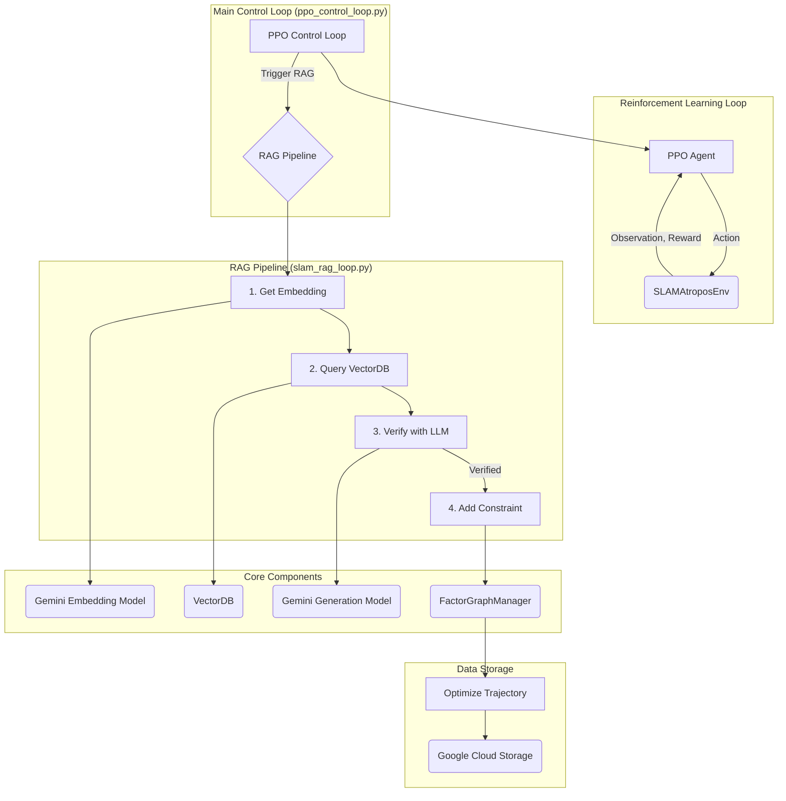

# Project Atropos: System Architecture and Overview

**Version:** 1.0
**Status:** In Draft

**Abstract:** This document provides a comprehensive architectural overview of Project Atropos. It details the project's collective mission, the functionality of its individual components, the data flow between them, and the underlying cloud infrastructure. This document is intended to serve as a definitive reference for all project members, adhering to the highest standards of clarity and technical accuracy.

---

## 1. Project Vision and Goals

*(To be completed by the Internal Code Committee)*

### 1.1. Mission Statement
To develop a robust and efficient SLAM system that leverages a Retrieval-Augmented Generation (RAG) pipeline to improve loop closure detection and overall mapping accuracy.

### 1.2. Core Objectives
*   To implement a simulated reinforcement learning environment for training and evaluating the SLAM agent.
*   To develop a RAG pipeline for finding and verifying loop closure candidates.
*   To use a factor graph to optimize the SLAM trajectory.
*   To train a PPO agent to control the SLAM process.

---

## 2. System Architecture

*(To be completed by the Internal Code Committee)*

### 2.1. High-Level Diagram

### 2.2. Data Flow
The system's data flow can be broken down into two main phases: initialization and the main control loop.

1.  **Initialization:**
    *   The process begins by populating the vector database. Keyframe captions are loaded from a text file (`datasets/captions.txt`).
    *   For each caption, a semantic embedding is generated using the Google Gemini Embedding Model.
    *   These embeddings, along with their associated metadata (filename, caption), are indexed into an in-memory Qdrant vector database managed by the `VectorDB` class.

2.  **Main Control Loop:**
    *   The PPO agent, operating within the `SLAMAtroposEnv`, receives an observation representing the current state of the SLAM system (e.g., drift, FPS).
    *   Based on this observation, the agent selects an action. If the action is to check for a loop closure (`add_semantic_constraint`), the RAG pipeline is triggered.
    *   A new "live" keyframe is simulated, and its caption is converted into a query embedding.
    *   This query embedding is used to search the vector database for the most similar historical keyframes. This search can be narrowed by a geometric pruning filter.
    *   The top candidates are sent to the Gemini Generation Model for verification. The model determines if the live caption and a candidate caption describe the same location.
    *   If a candidate is verified as a loop closure, a new constraint is added to the factor graph (`FactorGraphManager`).
    *   The factor graph is periodically optimized to refine the entire estimated trajectory of the SLAM agent.
    *   The final, optimized trajectory is saved to a text file and can be uploaded to Google Cloud Storage.
    *   The agent receives a reward based on the outcome of its action, reinforcing behaviors that lead to improved SLAM performance.

---

## 3. Component Breakdown

*   **`src` Directory: Core Logic**
    *   `atropos_env.py`: Defines the `SLAMAtroposEnv` class, a simulated reinforcement learning environment for the SLAM agent.
    *   `embedding_pipeline.py`: Contains the logic for the embedding pipeline, including embedding generation and caption loading.
    *   `gcs_auth.py`: A simple script for setting the `GOOGLE_APPLICATION_CREDENTIALS` environment variable.
    *   `ppo_control_loop.py`: Contains the main PPO control loop for training and evaluating the SLAM agent, including the `FactorGraphManager` and RAG loop closure logic.
    *   `slam_rag_loop.py`: Contains the main RAG-based SLAM process, including database population, candidate finding, and LLM verification.
    *   `vector_db.py`: Encapsulates all vector database operations.
*   **`scripts` Directory: Automation and Utilities**
    *   `automate_icr.py`: A script for automating the process of running the ICR (Iterative Closest Rejection) algorithm.
    *   `calculate_ate.py`: A script for calculating the Absolute Trajectory Error (ATE) between two trajectories.
    *   `check_auth.py`: A script for checking the authentication status of the user.
    *   `collect_rollouts.py`: A script for collecting rollouts from the SLAM agent.
    *   `configure_secrets.py`: A script for configuring the secrets for the project.
    *   `create_bucket.py`: A script for creating a new Google Cloud Storage bucket.
    *   `create_noisy_trajectory.py`: A script for creating a noisy trajectory from a ground truth trajectory.
    *   `download_dataset.py`: A script for downloading the dataset for the project.
    *   `download_nyu_depth_v2.py`: A script for downloading the NYU Depth V2 dataset.
    *   `generate_captions.py`: A script for generating captions for the images in the dataset.
    *   `generate_metaspatial_dataset.py`: A script for generating a metaspatial dataset from the NYU Depth V2 dataset.
    *   `run_icr_ablation.py`: A script for running an ablation study on the ICR algorithm.
    *   `upload_file.py`: A script for uploading a file to a Google Cloud Storage bucket.
*   **`notebooks` Directory: Prototyping and Benchmarking**
    *   `benchmarking/benchmark_hnsw.py`: A script for benchmarking the performance of the HNSW (Hierarchical Navigable Small World) algorithm.
    *   `benchmarking/benchmark_hnsw_quick.py`: A quick version of the HNSW benchmark script.
    *   `prototypes/benchmark_models.py`: A script for benchmarking the performance of different models.
    *   `prototypes/mobilenet_verification.py`: A script for verifying the performance of the MobileNet model.
    *   `prototypes/test_gemini.py`: A script for testing the Gemini API.
    *   `prototypes/train_mobilenet.py`: A script for training the MobileNet model.

---

## 4. Cloud Infrastructure

### 4.1. Service Integration
The project leverages two main Google Cloud services:

*   **Vertex AI:** The `slam_rag_loop.py` and `ppo_control_loop.py` modules use the Vertex AI SDK to interact with the Gemini family of models. Specifically, it uses `genai.embed_content` for generating semantic embeddings of text captions and `genai.GenerativeModel` for the LLM-based verification of loop closure candidates. This integration is central to the RAG pipeline.
*   **Google Cloud Storage (GCS):** The `ppo_control_loop.py` module includes functionality to save the final, optimized SLAM trajectory to a GCS bucket. This is handled by the `upload_to_gcs` function, which uses the `google-cloud-storage` library to upload the trajectory file.

### 4.2. Infrastructure as Code (IaC)
The project does not currently use any Infrastructure as Code (IaC) tools like Terraform or CloudFormation to manage its cloud resources. The Google Cloud Storage bucket is created manually using a script (`scripts/create_bucket.py`), and the Vertex AI resources are accessed directly through the SDK.

Adopting an IaC approach would provide several benefits, including:

*   **Reproducibility:** IaC would allow the project's infrastructure to be easily reproduced in different environments.
*   **Versioning:** IaC would allow the project's infrastructure to be versioned and tracked in a source control system.
*   **Automation:** IaC would allow the project's infrastructure to be automatically provisioned and configured.

### 4.3. Security and Access Control
*   **Authentication:** The project uses a service account to authenticate with the Google Cloud Platform. The service account key is stored in a JSON file and the path to this file is set in the `GOOGLE_APPLICATION_CREDENTIALS` environment variable.
*   **Authorization:** The service account has been granted the necessary permissions to access the Google Cloud AI Platform and Google Cloud Storage.
*   **Secrets Management:** The project uses a `.env` file to store the `GEMINI_API_KEY`. This is a good practice, as it prevents the API key from being hard-coded in the source code. However, the `.env` file is not encrypted, so it is not a secure way to store secrets.

---

## 5. Final Review and Verification

*(To be completed by the Review Committee)*

*This section will contain the final sign-off from the review committee, verifying the accuracy and clarity of the document.*
