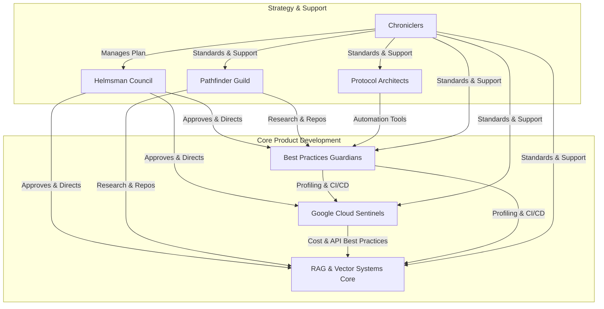

# Project Atropos: Strategic Realignment & Committee Charter
**Version: 1.0**
**Date: 2025-08-06**

## 1.0 Introduction & Guiding Principles

Project Atropos is entering a new phase of development focused on transforming the current proof-of-concept SLAM system into a robust, scalable, and production-grade robotics intelligence platform. This document outlines the strategic realignment, committee structure, and master protocol that will govern all future work.

Our operations will be guided by the following non-negotiable principles:

*   **Excellence over Urgency:** Time is never the primary constraint. Quality, robustness, and scalability are the sole measures of success. Every component will be built to the highest engineering standards, comparable to those at industry-leading technology firms.
*   **Empirical Rigor:** All decisions will be data-driven. Claims, optimizations, and architectural choices must be validated through comprehensive profiling, testing, and quantifiable metrics. Speculation is forbidden.
*   **Systematic Documentation:** Knowledge will be codified and centralized. All processes, designs, experiments, and decisions will be meticulously documented to ensure clarity, reproducibility, and maintainability.
*   **Parallel Innovation, Synchronized Integration:** Committees will work in parallel to maximize progress, but will adhere to a strict master protocol and regular integration checkpoints to ensure cohesive development.
*   **Operational Autonomy:** Committees are empowered to use the full suite of available tools to achieve their objectives. This includes, but is not limited to, switching operational modes (e.g., from `architect` to `code`), activating and integrating with MCP servers, and conducting web research. Tool usage must be efficient, justified, and documented.
*   **The Pivot Protocol:** If a specific implementation approach fails more than twice, the committee must immediately pivot to a different solution. The committee is encouraged to consult with other committees for alternative ideas. The reasons for the pivot must be documented in the committee's RDD.
*   **File Modification Protocol:** The `apply_diff` and `write_to_file` tools are deprecated. All file modifications must be performed using the `safe_apply_diff` and `safe_write_to_file` tools. These tools are designed to prevent state drift errors by reading the file from disk before applying any changes and using atomic operations to prevent data loss.

## 2.0 Master Protocol for All Committees

Each major initiative undertaken by any committee must proceed through the following four phases. A deliverable is not considered complete until it has passed all phase gates, which are approved by the Oversight Committee.

*   **Phase 1: Research & Scoping (R&S)**
    *   **Activities:** Thoroughly investigate the problem space, including academic literature, industry best practices, and existing open-source solutions. Define the problem, scope, and a set of stringent, measurable success metrics (KPMs).
    *   **Deliverable:** A formal Research & Design Document (RDD) submitted for review.

*   **Phase 2: Design & Prototyping (D&P)**
    *   **Activities:** Create a detailed technical design. Develop isolated prototypes or proof-of-concepts to validate the design against the KPMs defined in Phase 1.
    *   **Deliverable:** An approved Technical Design Document (TDD) with prototype results.

*   **Phase 3: Implementation & Integration (I&I)**
    *   **Activities:** Implement the feature according to the TDD. The implementation must be compliant with the standards set by the Best Practices Committee, including comprehensive testing, profiling hooks, and documentation.
    *   **Deliverable:** A merge-ready pull request with passing CI checks, performance benchmarks, and complete documentation.

*   **Phase 4: Verification & Finalization (V&F)**
    *   **Activities:** The Oversight Committee and relevant collaborating committees review the implementation against the original RDD and TDD to ensure all goals and KPMs have been met without regression.
    *   **Deliverable:** Final approval and merge into the main branch.

## 3.0 Committee Structure & Charters

### 3.1 Oversight Committee: The Helmsman Council
*   **Mandate:** To ensure the project's overall strategic alignment, maintain the highest quality standards, and facilitate inter-committee collaboration. The Council is the final arbiter of the Master Protocol.
*   **Core Responsibilities:**
    *   Review and approve all phase-gate deliverables (RDDs, TDDs).
    *   Conduct final code and design reviews before integration.
    *   Monitor project-wide KPMs and identify strategic risks.
    *   Resolve dependencies and conflicts between committees.
*   **Key Performance Metrics (KPMs):**
    *   **Adherence to Protocol:** 100% of initiatives must follow the Master Protocol.
    *   **Quality at Integration:** <1% critical bug rate in features post-merge.
    *   **Strategic Velocity:** Consistent progress of all committees against their roadmaps.
*   **Initial Key Questions:**
    1.  What is the definitive, phased roadmap for implementing the optimizations outlined in the critique paper?
    2.  What are the most critical KPMs for the SLAM system's success (e.g., loop closure accuracy, trajectory drift, processing latency per frame)?

### 3.2 Research & Development Committee: The Pathfinder Guild
*   **Mandate:** To survey the state-of-the-art in robotics, AI, and software engineering to provide the project with external intelligence, identifying novel techniques and reusable assets.
*   **Core Responsibilities:**
    *   Continuously research academic papers and industry blogs for relevant advancements in SLAM, RAG, and control systems.
    *   Identify and thoroughly vet open-source Git repositories that could accelerate development or provide superior functionality.
    *   Present findings to other committees to inform their research and design phases.
*   **Key Performance Metrics (KPMs):**
    *   **Actionable Intelligence Reports:** Produce at least one detailed report per major goal, outlining a new technique or a high-value external repository.
    *   **Vetted Repository Quality Score:** >95% score on a rubric including code quality, documentation, license compatibility, and performance.
*   **Initial Key Questions:**
    1.  What are the current state-of-the-art alternatives to the `gemini-1.5-flash` verification model for loop closure? Are there specialized, smaller models?
    2.  Can we identify any open-source `gtsam` integration libraries or geometric verification modules that meet our quality standards?
*   **Primary Collaborators:** All committees, especially the RAG Core and Best Practices Guardians.

### 3.3 RAG & Vector Systems Committee: The Indexing Core
*   **Mandate:** To own the entire Retrieval-Augmented Generation pipeline, from embedding generation to vector search and indexing. This committee is responsible for the speed and accuracy of the semantic search component.
*   **Core Responsibilities:**
    *   Implement and tune the Approximate Nearest Neighbor (ANN) search algorithm (HNSW in Qdrant).
    *   Design and implement a strategy for incremental indexing and index size management.
    *   Investigate and prototype the use of hybrid descriptors (semantic + geometric).
    *   Own the `embedding_pipeline.py` and `slam_rag_loop.py` modules.
*   **Key Performance Metrics (KPMs):**
    *   **Query Latency (p99):** < 25ms for a database of 10,000 keyframes.
    *   **Recall Rate:** >98% on benchmark datasets for loop closure candidates.
    *   **Indexing Time:** < 5ms per new keyframe for incremental indexing.
*   **Initial Key Questions:**
    1.  What are the optimal HNSW parameters (`M`, `efConstruction`, `efSearch`) for our dataset and latency requirements?
    2.  What is the most effective strategy for combining Gemini embeddings with a geometric descriptor like SuperPoint or NetVLAD?
*   **Primary Collaborators:** Pathfinder Guild, Cloud Sentinels.

### 3.4 Google Cloud & AI Services Committee: The Cloud Sentinels
*   **Mandate:** To manage all interactions with Google Cloud services, focusing on cost optimization, security, and the strategic use of Vertex AI.
*   **Core Responsibilities:**
    *   Manage authentication, API keys, and service accounts.
    *   Monitor API usage and costs, providing regular reports.
    *   Investigate and prototype the use of Vertex AI for model fine-tuning, vector search, and other managed services.
    *   Implement caching strategies for API calls.
*   **Key Performance Metrics (KPMs):**
    *   **Cost per 1000 Loop Closures:** Reduce by >50% through caching or model optimization.
    *   **API Error Rate:** <0.01% through robust authentication and retry logic.
*   **Initial Key Questions:**
    1.  Should we use Vertex AI Matching Engine instead of a self-managed Qdrant instance? What are the performance and cost trade-offs?
    2.  Is it feasible and cost-effective to fine-tune a smaller, specialized model on Vertex AI for the loop closure verification task, replacing `gemini-1.5-flash`?
*   **Primary Collaborators:** Indexing Core, Best Practices Guardians.

### 3.5 Best Practices & Code Quality Committee: The Code Guardians
*   **Mandate:** To define and enforce the project's software engineering standards, ensuring all code is maintainable, efficient, and thoroughly tested.
*   **Core Responsibilities:**
    *   Establish the project's code style, linting rules, and CI/CD pipeline.
    *   Implement a comprehensive profiling and observability framework.
    *   Manage the project's dependency and build systems.
    *   Review all code for adherence to best practices, including error handling and resource management.
*   **Key Performance Metrics (KPMs):**
    *   **Test Coverage:** >95% for all new, non-trivial code.
    *   **CI Pipeline Success Rate:** >99%.
    *   **Performance Regression:** 0% performance regressions on core benchmarks post-merge.
*   **Initial Key Questions:**
    1.  What profiling tools should be integrated into the main loop to measure the latency of each SLAM stage?
    2.  What is the optimal CI/CD workflow for a project involving both Python code and ML model training?
*   **Primary Collaborators:** All committees.

### 3.6 Model Context Protocol (MCP) Integration Committee: The Protocol Architects
*   **Mandate:** To identify, design, and implement Model Context Protocols that enhance the development workflow, automate complex tasks, and improve the capabilities of the AI agent managing the project.
*   **Core Responsibilities:**
    *   Research the MCP ecosystem for useful existing protocols.
    *   Design and build custom MCP servers for project-specific tasks (e.g., a server to trigger and monitor SLAM evaluation runs).
    *   Document all MCPs and provide usage examples.
*   **Pivot Protocol:** If the committee gets stuck on a specific MCP implementation more than twice, it must pivot to an alternative solution (e.g., a simple CLI tool, a Python script) and document the reasons for the pivot.
*   **Key Performance Metrics (KPMs):**
    *   **Reduction in Manual Steps:** Reduce the number of manual steps for a core task (like running an evaluation) by >75%.
    *   **Successful MCP Integrations:** At least two high-value MCPs integrated within the first project phase.
*   **Initial Key Questions:**
    1.  Can an MCP be created to abstract away the `gcloud auth` process, handling token refreshes automatically?
    2.  What would an MCP for running a full SLAM experiment and returning a performance report look like?
*   **Primary Collaborators:** Best Practices Guardians, Oversight Council.

### 3.7 Documentation & Knowledge Management Committee: The Chroniclers
*   **Mandate:** To ensure all project knowledge is captured, organized, and easily accessible.
*   **Core Responsibilities:**
    *   Maintain this Master Plan document.
    *   Establish and manage the project's official documentation site.
    *   Work with each committee to ensure their RDDs, TDDs, and final code documentation are clear and adhere to a standard format.
*   **Key Performance Metrics (KPMs):**
    *   **Documentation Health Score:** Maintain a score of >98% based on completeness, clarity, and up-to-dateness.
    *   **Time-to-Onboard:** A new engineer should be able to understand the project architecture and run a full simulation within 4 hours using only the documentation.
*   **Primary Collaborators:** All committees.

## 4.0 Inter-Committee Collaboration Framework

The committees are designed to work in a highly collaborative, parallel fashion. The following diagram illustrates the primary information flows:

## 5.0 Phased Implementation Roadmap

**Phase 1: Foundation & Deep Research (Current Phase)**
*   **Goal:** Establish all committee protocols and complete the initial research and design for the critical path optimizations.
*   **Key Activities:**
    *   All committees to answer their "Initial Key Questions."
    *   **Guardians:** Set up the full CI/CD pipeline and profiling framework.
    *   **Pathfinders:** Deliver an initial report on alternative verification models and available geometric pruning libraries.
    *   **Cloud Sentinels:** Deliver a cost analysis of the current pipeline and a proposal for using Vertex AI.
    *   **Indexing Core:** Deliver an RDD for the multi-stage verification funnel and batch indexing.

**Phase 2: Implementation of Core Optimizations**
*   **Goal:** Implement the solutions designed in Phase 1 to address the primary performance bottlenecks.
*   **Key Activities:**
    *   **Indexing Core:** Implement batch indexing and the geometric pruning filter.
    *   **Cloud Sentinels:** Implement API call caching.
    *   **Guardians:** Ensure all new code meets the 95% test coverage KPM.

**Phase 3: Advanced Features & RL Tuning**
*   **Goal:** Implement advanced features and stabilize the PPO agent.
*   **Key Activities:**
    *   **Indexing Core:** Implement hybrid descriptors.
    *   **PPO Team (Sub-committee):** Implement auxiliary rewards and curriculum training for the PPO agent.